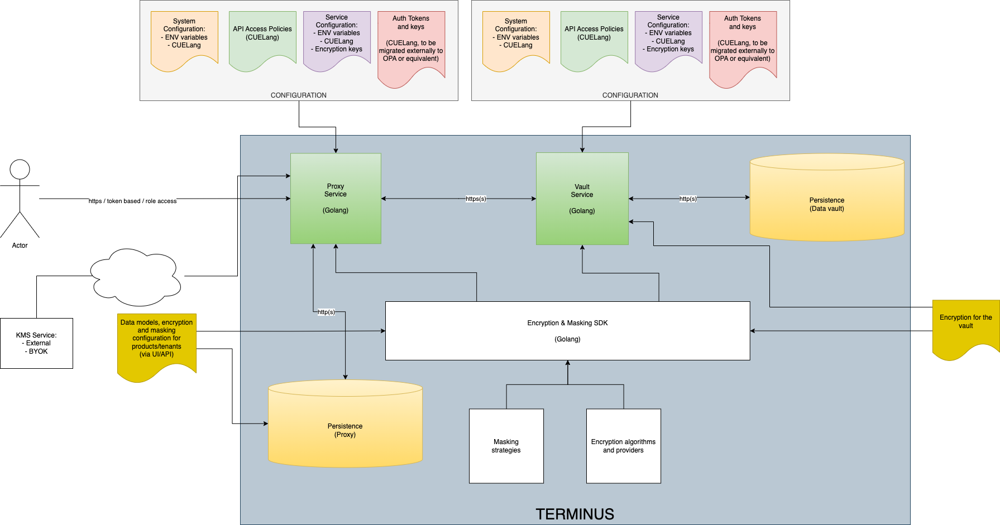

# Components and Architecture

Terminus can be generally represented as the following:

## 

Terminus is by design, a multi-component decupled system where data is protected from each of the components.
Nothing travels in the clear unless explicitly set, thus enabling the implementation of the most stringent data privacy and data segregation policies. The data stored in the vault is encrypted as specified in the proxy and has no visibility on it

From an architectural point of view, Terminus is made of the following components having the following responsibilities:

## [Proxy Service](./proxy)

- Exposes a public facing API for storage and retrieval of data
- Via no code UI, allows the setup and configuration of the business data models to be encrypted and masked
- Implements the access control policies (ACP), including authentication, authorisation, role mapping and granular access
- Performs the relevant encryption/decryption/masking operations
- Interacts with external KMSs enabling BYOK models

## Proxy Persistence

- Stores and retrieves data related to business models and product/tenant configuration

## [Vault Service](./vaultservice)

- Exposes a private API primitive for the proxy to store and retrieve data
- Enables an additional layer of encryption. Anything that travels to the vault, beyhond the business encryption policies gets encrypted at the vault level
- It has no knowledge or understanding of business models, treating the incoming and outgoing data completely transparently

## [Persistence vault](./vault)

- Stores and retrieves data
- Has no knowledge of whatever payloads are stored internally

The different services can be compiled and run independently. The easier way of getting started is by running them with the Docker Compose file provided using the official published images.
