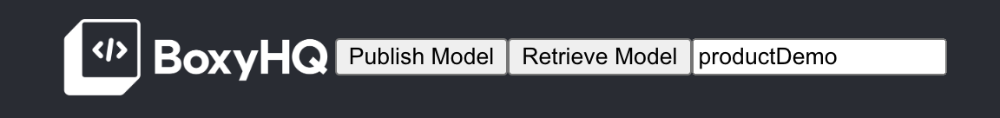
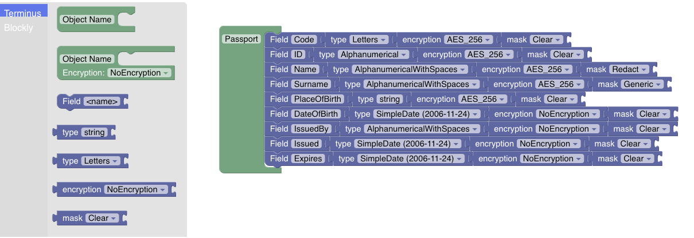
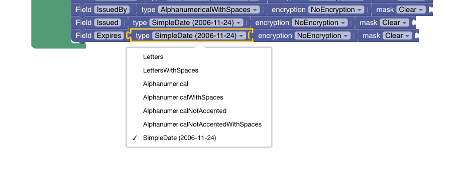
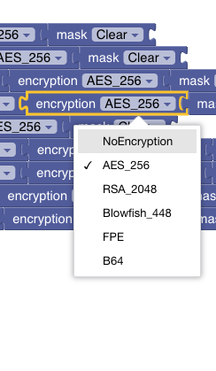
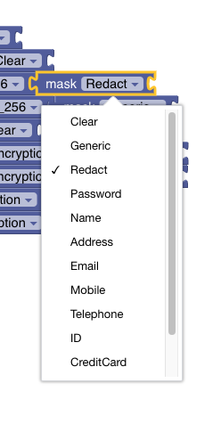

# Proxy Service

The proxy service is the outermost client facing of Terminus. Amongst it's roles and responsibilities:

- Enables no-code configuration of encryption and masking business data models
- Supports multi-tenancy and multi-product logical segregation via API URL paths.

> :warning: **IMPORTANT**: Terminus only supports currently one business data model (alpha version), therefore all tenants/products use the same business and encryption models and configurations

- It exposes the public API for clients to interface with the privacy vault
- Interfaces with the Vault service
- Implements Access Control Policies
- Interacts with external KMSs enabling BYOK models

It is written in [Go](https://go.dev/) and can be accessed by default here [http://localhost:3002](http://localhost:3002)

---

## Data Modelling, Encryption and Masking UI

Data modelling is done via a visual interface that allows the composition via puzzle pieces.

> :warning: **IMPORTANT**: changes on encryption policies on fields of stored datasets will most likely render the existing data useless due to the impossibility of interpret and/or decrypt the data. Thread carefully. Adding and removing fields is allowed.

### Model Management

- Terminus supports different business models - one per product. In order to select the relevant model, enter it in the input box below and click on the "Retrieve Model" button.



- In case the product doesn't exist, a sample model will be loaded as a starting point and once published, the relevant product will have the model associated.
- When publishing the model, a serverside validation will ocurr.

> :warning: **IMPORTANT**: The server will reject the publishing of an invalid model with a 400 Error code. TODO - needs to be handled in the UI

> :warning: **IMPORTANT**: Currently the proxy service keeps a historical of all the published model versions. In future releases it will be possible to manage such historical versions and rollback to previous business models. Currently it is not exposed via the visual interface.

### Sample Model - Product Model

- Below is an illustrated an example of the shallow model of a Passport, with its individual fields, restrictions on the type, type of encryption and decryption to be applied and the masking to apply once data is read.

    **NOTE**: Future versions will include access-role-based masking policies and multitenancy on the proxy side, allowing for different clients to manage their own models.

    

    **NOTE**: all fields are currently treated as strings. No numerical types are supported yet.

### Field Restrictions

- The below illustration shows the current supported restrictions on the values. Behind the scenes it is implemented via regular expressions.

    

#### String

- A special type of field is a string. Terminus configuration is based on [CUE lang](https://cuelang.org). This type of field permits the inclusion of specific patterns that CUE lang supports (enumerations, regular expressions, etc.)

    

    For example, the field "PlaceOfBirth":

    `string`: would allow any string to be inputed

    `string | !="" | *"NONE"`: would allow any non empty string with a default value of `NONE`

### Encryption

- Following are the planned encryption types to be supported by Terminus. Currently terminus supports AES Encryption with a 32 bytes key.



### Masking

- Terminus supports currently generic and redact masking policies.



---

## Configuration

### Running via Docker Compose

When running on docker, all the environent variables are specified either as environment variables or in the `.env` file.

**When running via `docker compose` the below does not apply.**

### Default vs Runtime

The Proxy Service ships with default configurations including service components configurations as well as a default business model (the Passport) for reference.
The `default` configuration ships in the `./conf/default` directory and it is copied on startup on the `./conf/runtime` directory IF such directory is empty.

The `./conf/runtime` directory is where the actual configurations are read from. That includes the UI business models.

The configuration files are as follows:

### model.cue and blockly.tmp

Both files are generated by the UI and contain the necessary information about the business models, encryption policies and masking policies. DO NOT EDIT MANUALLY.

### terminusProxyConf.cue

CUE lang based configuration file containing the necessary variables. These can be set both in this file or as ENVIRONMENT variables.
**If set as environment variables, those will take precedence over the ones defined in the configuration default/runtime files.**

### access.cue

Defines:

- The access control policies to the APIs via CUE lang definition. Multiple ACPs can be defined, but only the one assigned to the `defaultPolicy` will be used.

```
///////////////////////////////////////////////////////////////////////
// API Definitions
///////////////////////////////////////////////////////////////////////
#apiSet1: acp.#APIsSet & {
 version: "v1"
 apis: {
  vaultStatus: {
   path: "/status"
   methods: [ "GET" ]
   permissions: [ "READ", "ADMIN", "WRITE" ]
  }
  publishModel: {
   path: "/admin/model"
   methods: [ "POST" ]
   permissions: [ "ADMIN" ]
  }
  registerTenantProductDEK: {
   path: "/admin/{tenant}/{product}/dek"
   methods: [ "POST" ]
   permissions: [ "ADMIN" ]
  }
  getModel: {
   path: "/admin/model"
   methods: [ "GET" ]
   permissions: [ "ADMIN" ]
  }
  createVaultEntries: {
   path: "/{tenant}/{product}/data"
   methods: [ "POST" ]
   permissions: [ "WRITE" ]
  }
  readOneVaultEntry: {
   path: "/{tenant}/{product}/data/read/{type}/{token}"
   methods: [ "GET" ]
   permissions: [ "READ" ]
  }
  readVaultEntryMultiple: {
   path: "/{tenant}/{product}/data/read/{type}"
   methods: [ "POST" ]
   permissions: [ "READ" ]
  }
 }
}

// this is the policy the systtem will read
defaultPolicy: #apiSet1

///////////////////////////////////////////////////////////////////////
// Policies
///////////////////////////////////////////////////////////////////////

// The request is filled by the calling system
apiRequest: acp.#APIRequest & {}

// Sample policy
access: acp.#AuthResponse & {
 allowed: acp.#defFalse
 request: apiRequest
 for permission in defaultPolicy.apis[request.apiName].permissions {
  if list.Contains(apiKeysAndPermissions[request.access_token], permission) {
   allowed: true
  }
 }
}

```

**NOTES**:

- the paths in the API definitions are values accepted by Go's [Gorilla Mux's](https://github.com/gorilla/mux) specification.
- the names in the API definitions (i.e. `vaultStatus`) are mapped via code to the relevant handling functions.
- the `version` is used as part of the path. An example of the status endpoint served by a proxy running locally on port 3002 would be:
    [http://127.0.0.1:3002/v1/status](http://127.0.0.1:3002/v1/status)

---
---

- The API Keys and their role-based mapping

```
///////////////////////////////////////////////////////////////////////
// API Keys
///////////////////////////////////////////////////////////////////////
apiKeysAndPermissions: acp.#AuthTokens & {
 readAPIKey1: [ "READ" ]
 writeAPIKey1: [ "WRITE" ]
 adminAPIKey1: [ "ADMIN" ]
 allAPIKey1: [ "READ", "WRITE", "ADMIN" ]
 readwriteAPIKey1: [  "READ","WRITE" ]
}
```

**NOTE**: this will be removed and implemented either as an external service or fully integrated in an OPA or similar access control framework.

---

## API

[Swagger API](https://github.com/boxyhq/terminus/blob/main/swagger/proxy/swagger.json)
