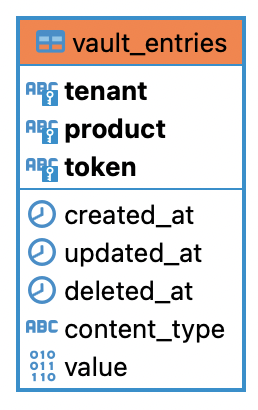
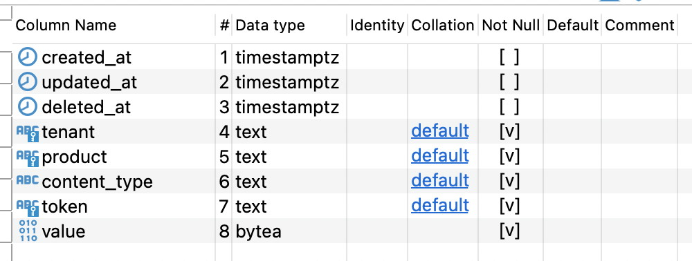

# Persistence Vault

The persistence vault is the persistent layer where data is stored. Amongst it's roles and responsibilities:

- The persistent store implementation is one of the ones supported by [GORM](https://gorm.io/)
  - Terminus ships by default with a PostgreSQL data store
- Supports multi-tenancy and multi-product logical segregation via column keys
- All data is encrypted and there is no indication of what the data stored is
- It exposes the low-level API for the Proxy to interface with the persistence
- Can implement additional encryption at rest if supported by the store implementation
- It is not business model aware
- It's scalability, partitioning and indexing capabilities is directly depending on the choice of store

It is written in [Go](https://go.dev/).

---

## Interaction with the Persistence Vault

Leverages [GORM](https://gorm.io/) to interface with the database. Currently is configured to use PostgreSQL but supports any persistence store supported by GORM.

Implements AES encryption against the data store.

> :warning: **IMPORTANT**: changes on encryption keys of the logical encryption layer will render the data stored useless.

---

## Configuration

The specific configuration depends on the data store.

By default it is PostgreSQL and gets configured via Docker Compose and environment variables.

---

## Schema

Terminus' schema is transparently deployed by the Vault Service layer via [GORM](https://gorm.io/)

It comprises one data table with the following structure:

With:

- `token` being the entry identifier (it's the ID that gets returned on creation and is required for retrieval)
- `value` being where the data is stored transparently
- `content_type` being the mime-type of the stored data for retrieval (json, xml, binary, etc.)
- `tenant`, `product` being the keys for multitenancy indicating Terminus' customer and the configured product
