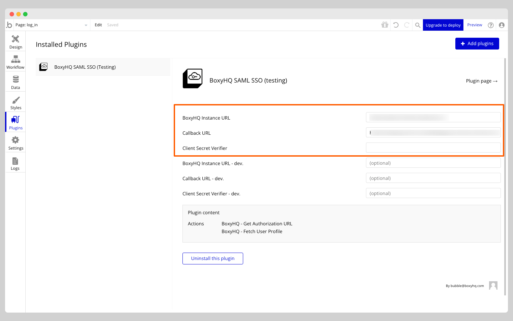
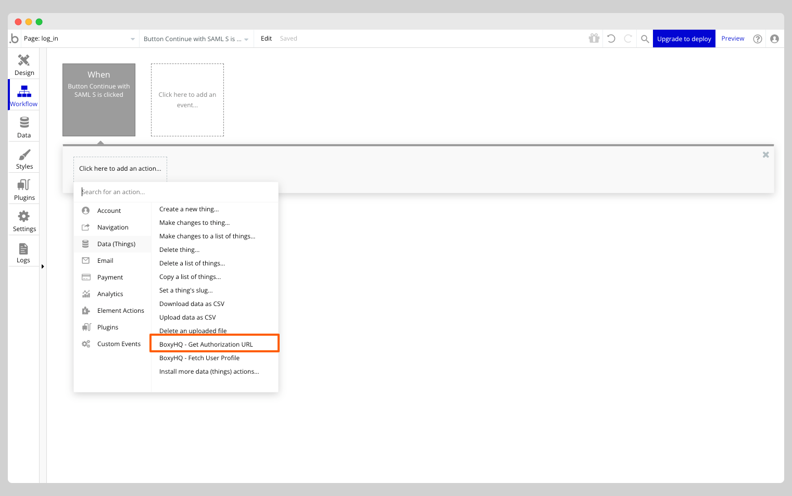
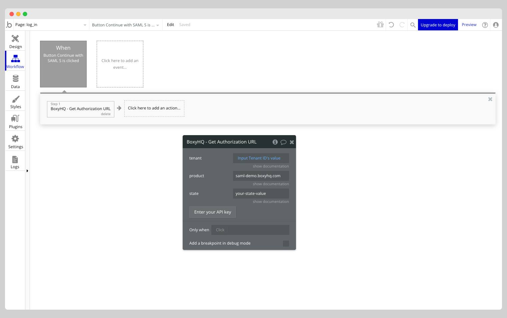
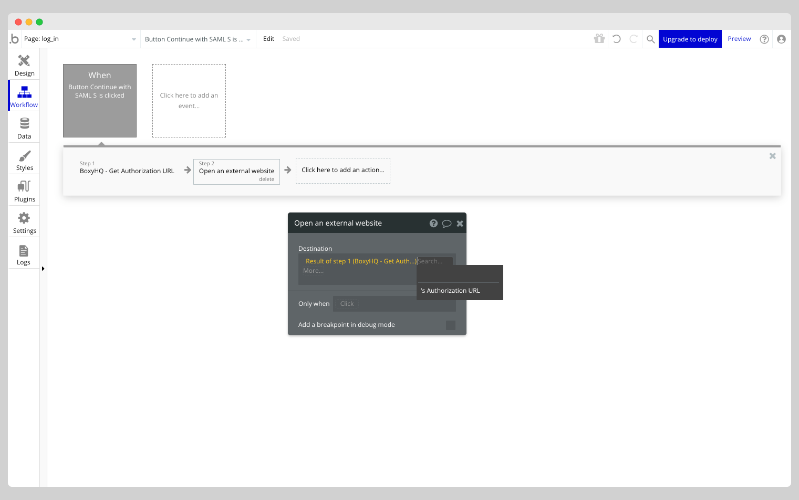
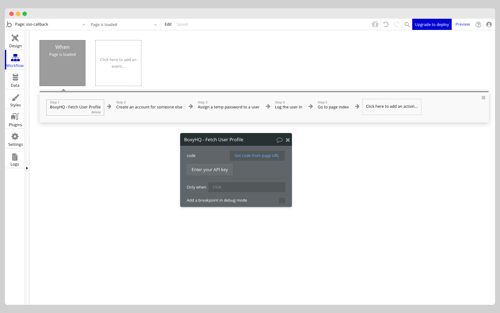
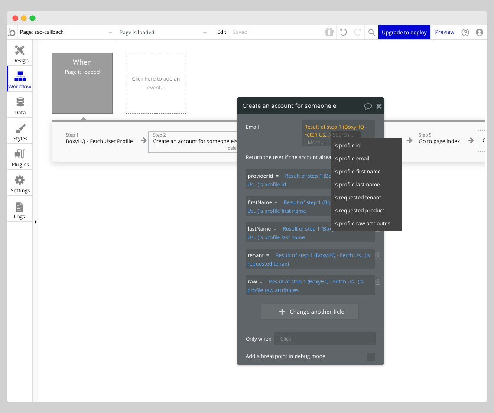

# SAML SSO Bubble Plugin

This guide will help you setup the BoxyHQ SAML SSO Bubble Plugin to add SAML SSO authentication to your Bubble application.

There is no easy way to add SAML SSO authentication to a Bubble application. This plugin provides a way to add SAML SSO authentication to your Bubble application with minimal effort.

This plugin contains API calls and Actions for connecting a Bubble.io application with the BoxyHQ SAML Jackson instance (Our SaaS or self-hosted) for SSO authentication.

Please head to [BoxyHQ SaaS](https://app.eu.boxyhq.com/auth/join) to create an SSO connection that you can then use in this Bubble plugin. You can also self-host SAML Jackson to use this plugin. Please follow the instructions in the [SAML Jackson Deployment Guides](https://boxyhq.com/guides/jackson#deployment-guides) to setup your SAML Jackson instance.

Try the [Example Bubble App](https://boxyhq-saml-sso.bubbleapps.io/version-test) to see the plugin in action.

## Install the plugin

Here are the quick steps to install the plugin from the Bubble editor:

- Go to your application's Plugins tab from left navigation.
- Click on the **Add plugins** button from the top right corner.
- Search for **BoxyHQ SAML SSO** and click on the **Install** button.

## Configure the plugin

Next step is to configure the plugin. Make sure you add the following values in the plugin settings:

- `BoxyHQ Instance URL`: The URL of your SAML Jackson instance (if self-hosting). Otherwise leave it blank and it will default to our hosted solution.

- `Callback URL`: The URL where the user will be redirected after successful authentication with the IdP. This URL should be the same as the URL you have configured while adding the SAML connection in SAML Jackson.

- `Client Secret Verifier`: This is optional. If you have configured a client secret verifier in SAML Jackson, you can add it here. If you have not configured a client secret verifier, you can leave this field blank.

Now you are ready to setup Workflows in your application to use the plugin.

## Plugin Actions

The plugin consists of the following Actions:

### Get Authorization URL

This action returns the URL to initiate the SAML SSO authentication flow. After successful authentication with the IdP, the user will be redirected to the `Callback URL` which you can configure in the plugin settings.

### Fetch User Profile

This action returns the user profile of the authenticated user. This action should be used after the user is redirected to the `Callback URL` after successful authentication with the IdP.

## Setup Workflows

Go to your application's **Workflows** tab from left navigation. You need to add 2 workflows to your application to use the plugin:

### Login Workflow

This workflow will be triggered when the user clicks on SAML SSO login button on your application.

Choose **BoxyHQ - Get Authorization URL** from the list of Actions.

Add the following values in the Action:

- `tenant`: A multi-tenant enterprise app must attach SSO connections to a tenant identifier. For example, an app can use any of the following as its tenant identifier: `domain`, `organization id`, `team id` or other unique identifier. This value will be used to fetch the SAML connection from SAML Jackson. For example: `boxyhq`.

- `product`: The unique identifier of the your application. This value can be obtained from the SaaS `Instructions` section after you have created a `Product`. If you are self-hosting then this is defined by you when creating the SSO connection. It can be static if you are using a single product with SAML Jackson. For example: `my-bubble-app`.

- `state`: A random string that will be used to verify the state of the request. This value will be passed back to your application in the `Callback URL`. You can use this value to verify the authenticity of the request.

This action will return `Authorization URL` which you can use to redirect the user to the IdP for authentication.

### SSO Callback Workflow

This workflow will be triggered when the user is redirected back to your application after successful authentication with the IdP.

Make sure you have added a new page in your application and configured the `Callback URL` in the plugin settings to point to this page. For example: `https://my-bubble-app.com/sso-callback`.

The callback URL will contain the following query parameters:

- `code`: The authorization code that can be used to fetch the user profile from SAML Jackson.
- `state`: The state value that was passed in the `Login Workflow`.

Here is an example of the callback URL: `https://my-bubble-app.com/sso-callback?code=52d7d591ba2c2e6efa4a8595edf9ac718b3658a7&state=random-state`

:::info
You can verify the authenticity of the request by comparing the `state` value in the query parameters with the `state` value that was passed in the `Login Workflow`. If the values of the `state` match, you can proceed to fetch the user profile from SAML Jackson.

This verification is out of scope of this plugin. You can skip this step if you don't want to verify the authenticity of the request. However, it is recommended to verify the authenticity of the request.
:::

Let's add the following Actions to the `SSO Callback Workflow`:

#### Action: BoxyHQ - Fetch User Profile

Choose **BoxyHQ - Fetch User Profile** from the list of Actions.

Add the following values in the Action:

`code`: The authorization code that was passed in the query parameters. You can use the dynamic value `Get data from page URL` to fetch the value of the `code` query parameter.

The Action will return the following values:

- `profile id` - The unique identifier of the user in IdP.
- `profile email` - The email address of the user.
- `profile first name` - The first name of the user.
- `profile last name` - The last name of the user.
- `requested tenant` - The tenant identifier that was passed in the `Login Workflow`.
- `requested product` - The product identifier that was passed in the `Login Workflow`.
- `profile raw attributes` - The raw attributes that was returned by the IdP. This value will be a JSON string.

#### Action: Create an user account for someone else

You can use the **Create an user account for someone else** Action to create a new user account in your application. This Action will create a new user account in your application if the user does not already exist. If the user already exists, it will update the user account with the new values.

Make sure you checked the **Return the user if the account already exists** checkbox in the Action.

You can configure the values as per your requirements.

#### Action: Assign a temp password to a user

Bubble requires a password to be set for a user to login to the application. To overcome this limitation, we can set a temporary password for the user account and use that password to login to the application. You can choose the **Assign a temp password to a user** Action to set a temporary password for the user account.

#### Action: Log the user in

You can use the **Log the user in** Action to login the user to your application.

Add the following values in the Action:

- `Email`: The email address of the user. You can use the dynamic value `profile email` to fetch the email address from the `Fetch User Profile` Action.
- `Password`: The temporary password that was set for the user account. You can use the dynamic value `temp password` to fetch the temporary password from the `Assign a temp password to a user` Action.

#### Action: Redirect to a page

You can use the **Redirect to a page** Action to redirect the user to an authenticated page in your application.

## Next Steps

Please reach out to our team for any questions or help with the setup. We are happy to help!
