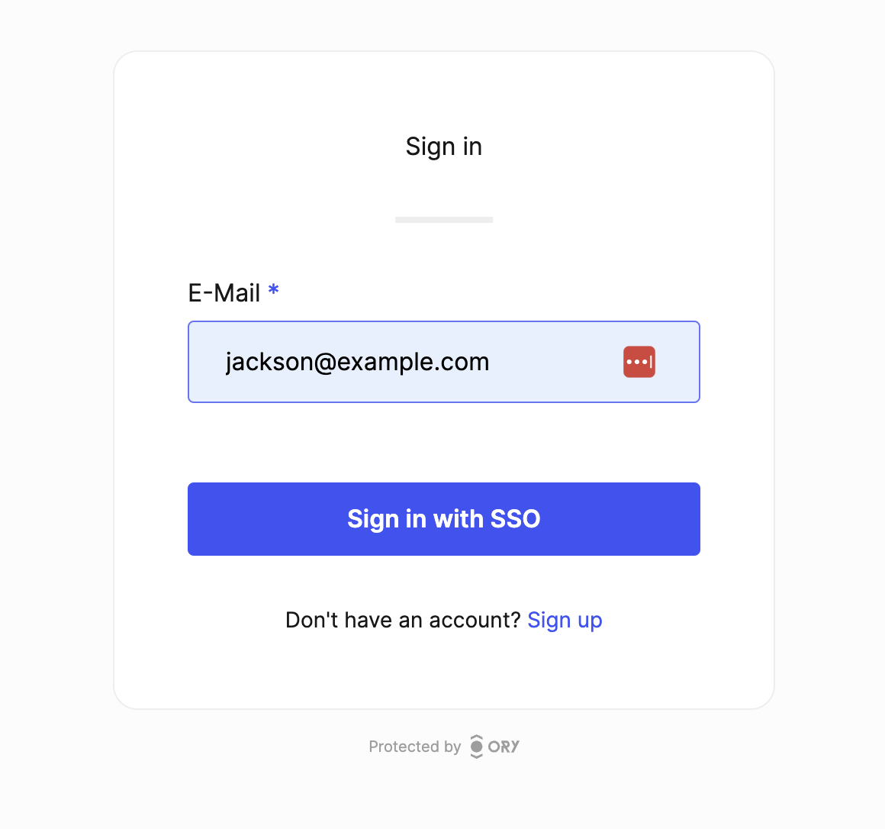

# Ory Network

[Ory Network](https://www.ory.sh/network/) is a fully hosted identity infrastructure for scaling teams. Based on open standards and supported by a team of security experts, it’s the fastest way to build secure auth flows.

We integrate with Ory Network to support SAML SSO. You can follow the step outlined below:

## Deployment Options

The easiest way to use the integration is to signup for a 30 day trial on our [SaaS solution](https://app.eu.boxyhq.com/auth/join). If you'd like to self-host (The Ory integration is an Enterprise Edition feature) please [reach out](mailto:support@boxyhq.com) to us to obtain an evaluation license.

Please note that we utilize the `B2B Organizations` feature of Ory Network which requires the Growth plan or higher with Ory.

## Obtain the Ory Network Session Token

Install the [Ory CLI](https://www.ory.sh/docs/guides/cli/installation) and then run `ory auth` to sign into your Ory Network account.

You will find the `session_token` in the `.ory-cloud.json` file in your home folder. Copy that out since you need this for the next step. The `session_token` starts with `ory_st` prefix.

You will also need your Project ID which can be obtained from your Ory account.

## Configure the Ory Session Token and Project ID

Log into your BoxyHQ account and create a new `Product` if you don't already have one. Our concept of `Product` is similar to Ory's `Project`.

Navigate to `Settings` in the sidebar and then the `Ory Integration` tab. Paste your session token and Project ID in the input fields and click the Save button.

If you are self-hosting, you have to set these [environment variables](https://boxyhq.com/docs/jackson/deploy/env-variables#enterprise-features---ory-integration)

## Integration explained

Now whenever you [create a new SSO connection on BoxyHQ](https://boxyhq.com/guides/jackson/configuring-saml-sso) it automatically calls Ory APIs to setup a new Organization and a Generic OIDC connection. All the user management still flows through Ory Network. Please remember to use the domain as the `tenant` in BoxyHQ.

If you now navigate to your Ory Account Experience UI and enter an email associated with the domain you just configured then the `Sign in with SSO` button appears.

## Next steps

- If you need any help with the integration or have any questions then please [Contact us](mailto:support@boxyhq.com)
